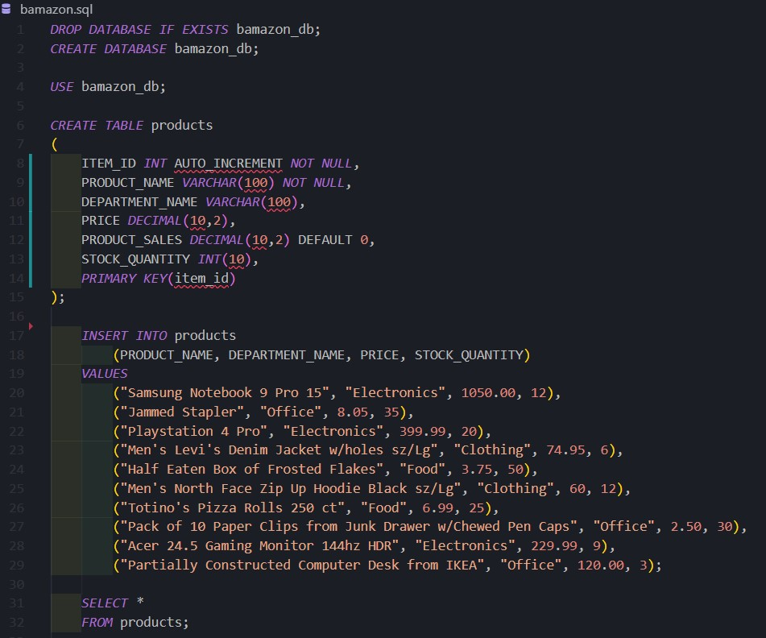
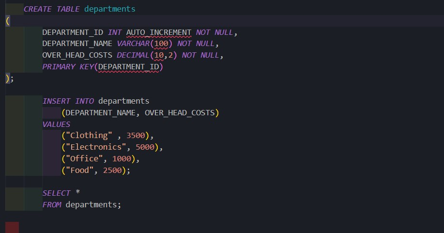
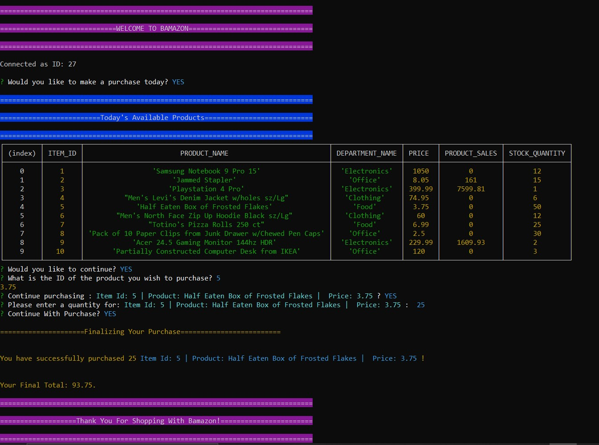
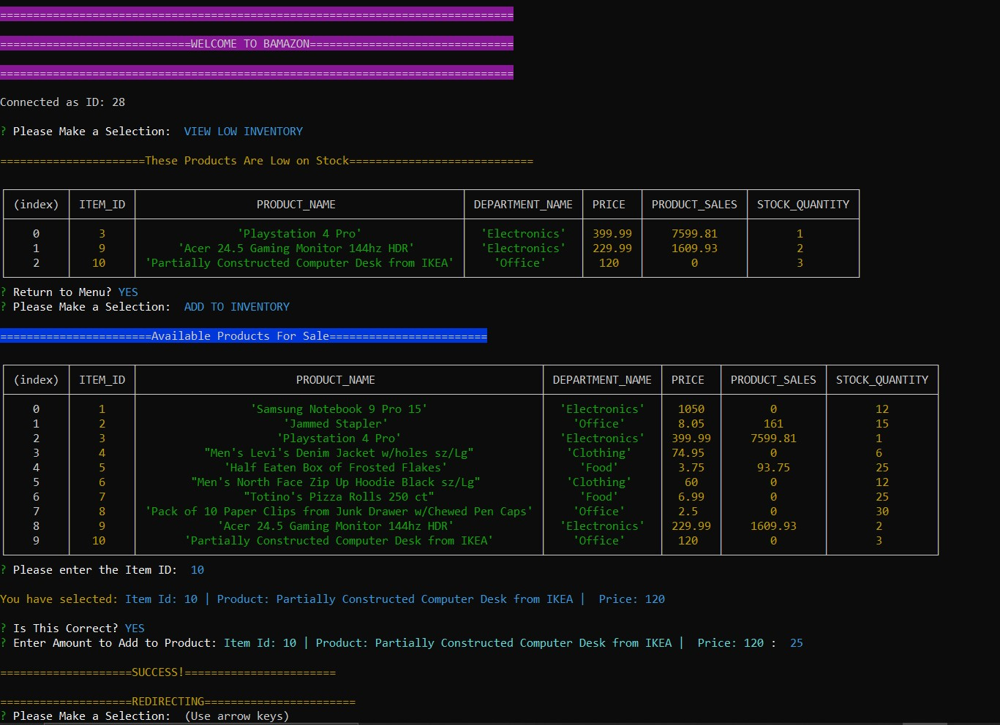
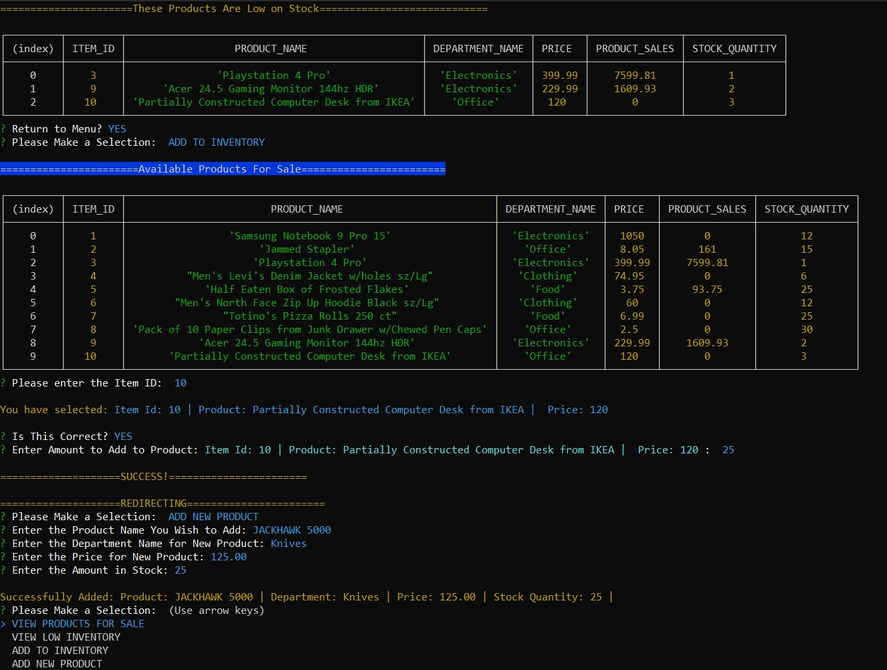
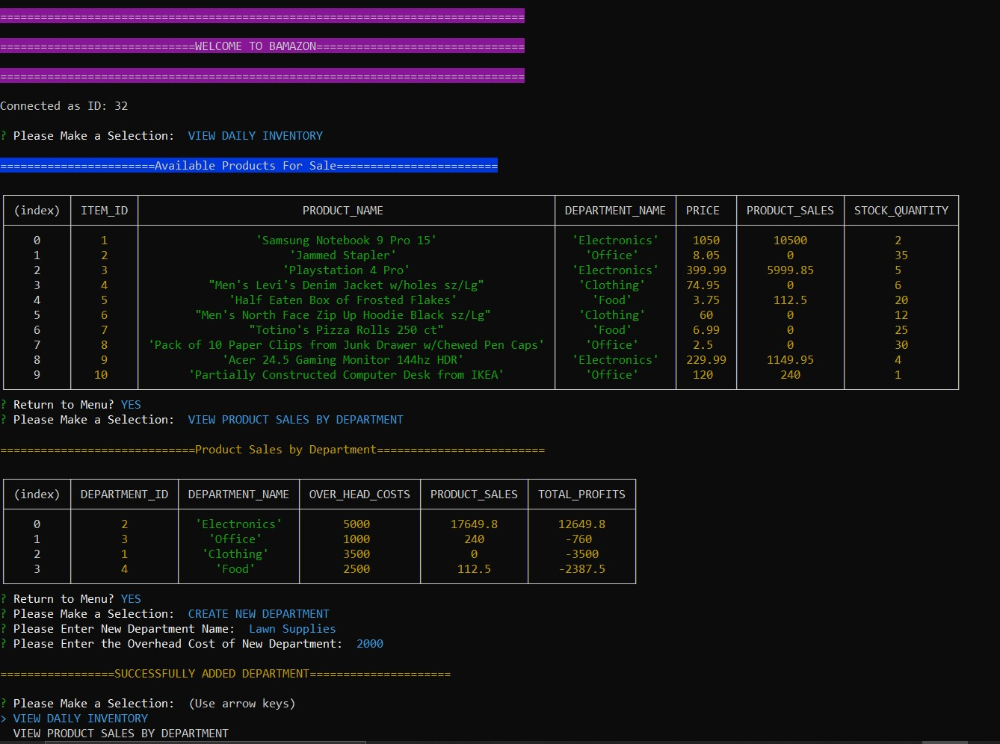

# Bamazon

Bamazon is an Amazon-like storefront created with MySQL and Node.js.  This appliction has 3 functions designed for customers, managers and supervisors.  The app takes orders from customers and depletes stock quantity from the store's inventory; the app also tracks product sales and inventory across all departments, as well as overhead costs and profit totals.

## Video Showing Functionality ##
[](https://drive.google.com/file/d/12tpkk4mhe2eFc1RyWM4qV4s4LpAqKTkw/view "bamazon")

## MySQL Schema ##
Created a MySQL database called ```Bamazon``` and connects to ```bamazonCustomer.js```, ```bamazonManager.js``` and ```bamazonSupervisor.js```.  Two databases are created: ```products``` and ```departments```.  The ```products``` table consists of: ITEM_ID, PRODUCT_NAME, DEPARTMENT_NAME, PRICE and STOCK_QUANTITY.  Ten fictional products are created along with their price, item id, what department they are in and amount in stock.  




## Bamazon Customer ##
* input ```node bamazonCustomer.js```
* prompts customer w/daily product list
* customer then inputs ```Item_ID``` to select product, then selects amount desired
* after checking stock, customer is either prompted that there is not enough in stock, and then is redirected, or continues with purchase
* updates SQL database with profit amount and decreases stock accordingly
* customer is then updated with total cost.


## Bamazon Manager ##
* input ```node bamazonManager.js```
* Menu Options: ```View Products for Sale``` , ```View Low Inventory```, ```Add to Inventory```, ```Add New Product```
* ```View Products for Sale```
          * app lists all available items, including ids, names, prices, etc.
* ```View Low Inventory```
          * app lists all products lower than quantity of 5
* ```Add to Inventory```
          * user can add more to stock quantity to any product
* ```Add New Product```
          * user can create a new product w/name, department, price and stock quantity



## Bamazon Supervisor ## 
* input ```node bamazonSupervisor.js```
* Menu Options: ```View Daily Inventory```, ```View Product Sales by Department```, ```Create New Department```
* utilized MySQL sum, aliases, group bys, and joins:
          * this code combined both ```products``` and ```departments``` tables to display total profits:
          * ```"SELECT departmentSales.DEPARTMENT_ID,departmentSales.DEPARTMENT_NAME,departmentSales.OVER_HEAD_COSTS, SUM(departmentSales.PRODUCT_SALES) as PRODUCT_SALES, (SUM(departmentSales.PRODUCT_SALES) - departmentSales.OVER_HEAD_COSTS) as TOTAL_PROFITS FROM(SELECT departments.DEPARTMENT_ID, departments.DEPARTMENT_NAME, departments.OVER_HEAD_COSTS, IFNULL(products.PRODUCT_SALES, 0) as PRODUCT_SALES FROM products RIGHT JOIN departments ON products.DEPARTMENT_NAME = departments.DEPARTMENT_NAME) as departmentSales GROUP BY DEPARTMENT_ID "```
* ```View Daily Inventory```
          * can view list of all available items
* ```View Product Sales by Department```
          * table displays w/dept Id, dept name, over head costs, product sales, total profits
* ```Create New Department```
          * can create new department w/id, name and over head costs



